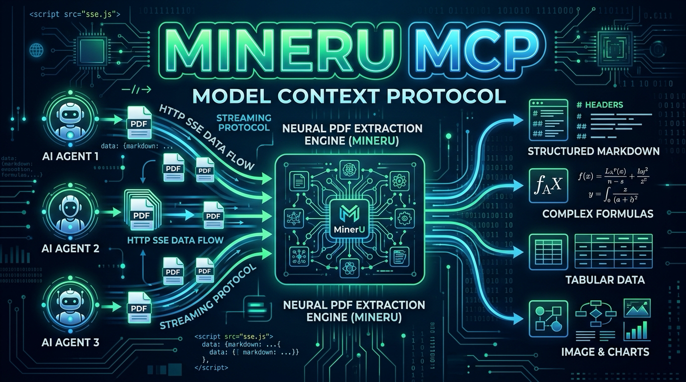

<p align="center">
  
</p>

[English](README.en.md) · **Español**

# MinerU MCP — Extracción y parseo de PDFs para agentes IA vía Model Context Protocol (MCP)

> **Transforma cualquier documento PDF en Markdown estructurado, tablas y código LaTeX para tus agentes IA.**
> Servidor MCP open source que expone las capacidades de extracción de MinerU (`PDF-Extract-Kit` / `MinerU2.5-VLM`) a Claude Code, Cursor, Windsurf, Hermes Gateway y cualquier cliente compatible con [Model Context Protocol](https://modelcontextprotocol.io). FastMCP HTTP/SSE + soporte para path local o Base64, **cero dependencias en clientes, 100% en tu hardware**.

[](LICENSE)
[](https://modelcontextprotocol.io)
[](pyproject.toml)
[](https://github.com/GermaniU/mineru-mcp/actions/workflows/ci.yml)
[](https://github.com/jlowin/fastmcp)
[](CONTRIBUTING.md)

**Tags:** `mcp-server` · `mineru` · `pdf-parser` · `ocr` · `latex` · `ai-agents` · `fastmcp` · `claude-code` · `cursor` · `hermes-gateway` · `local-first` · `self-hosted`

---

## 💡 Por qué existe

Extraer texto estructurado, tablas complejas y fórmulas matemáticas de archivos PDF suele requerir entornos Python pesados con PyTorch, OCR y modelos de visión en cada máquina cliente. **MinerU MCP** resuelve esto actuando como un adaptador middleware HTTP/SSE desacoplado:

- 🚀 **Cero Instalación Local**: Cualquier cliente MCP procesa documentos vía HTTP/SSE en puerto `8202` pasando un `file_path` local o enviando el PDF codificado en `file_base64`.
- 📊 **Markdown Estructurado y LaTeX**: Convierte encabezados, listas, tablas complejas y ecuaciones matemáticas en código LaTeX estándar listo para RAG.
- 🧠 **Ejecución Flexible (CPU / GPU VRAM)**: Pipeline por defecto en CPU sin tocar VRAM, o aceleración VLM opcional coordinada con el GPU Arbiter.

---

## 🏗️ Arquitectura y Deslinde de Componentes

> ⚠️ **IMPORTANTE: Entender los Límites del Sistema**
>
> `mineru-mcp` es **únicamente la capa de transporte e interfaz MCP**. No incluye el motor de procesamiento `mineru-api` ni la descarga en caché de modelos de HuggingFace.
> Para la guía de despliegue del servidor backend en el host Linux/Pop!_OS, consulta [docs/SERVER_SETUP.md](docs/SERVER_SETUP.md) y [docs/ARCHITECTURE.md](docs/ARCHITECTURE.md).

```
 +-------------------------------------------------------+
 |                 Clientes MCP (LAN)                    |
 | (Claude Code CLI / Cursor / Windsurf / Hermes Gateway)|
 +-------------------------------------------------------+
                             |
                             | HTTP / SSE (Puerto 8202)
                             v
 +-------------------------------------------------------+
 |                   mineru-mcp Server                   |
 |        (FastMCP + File Path / Base64 Decoder)         |
 +-------------------------------------------------------+
                             |
                             | Loopback HTTP (Puerto 8002)
                             v
 +-------------------------------------------------------+
 |                  MinerU Backend Host                  |
 |  (mineru-api + PDF-Extract-Kit + HuggingFace Cache)   |
 +-------------------------------------------------------+
```

---

## 📦 Instalación Rápida

### Requisitos
- Python 3.11+
- `uv` (recomendado) o `pip`

### Clonar e Instalar

```bash
git clone https://github.com/GermaniU/mineru-mcp.git
cd mineru-mcp

# Crear entorno virtual e instalar
uv venv
source .venv/bin/activate
uv pip install -e .
```

---

## ⚙️ Configuración (Variables de Entorno)

Crea un archivo `.env` o exporta las siguientes variables:

| Variable | Valor por Defecto | Descripción |
|----------|-------------------|-------------|
| `MINERU_API_URL` | `http://127.0.0.1:8002` | URL loopback donde escucha `mineru-api`. |
| `MCP_HOST` | `0.0.0.0` | Host binding para el servidor MCP. |
| `MCP_PORT` | `8202` | Puerto HTTP/SSE del servidor MCP. |
| `UPLOAD_DIR` | `/tmp/mineru_uploads` | Directorio temporal para decodificar PDFs Base64. |

---

## 🛠️ Herramientas Expuestas (Tool Reference)

### 1. `parse_pdf`
Extrae el contenido de un archivo PDF devolviendo Markdown estructurado, código LaTeX de fórmulas e imágenes.

- **Parámetros**:
  - `file_path` (*string*, opcional): Ruta absoluta al archivo PDF en el sistema de archivos host.
  - `file_base64` (*string*, opcional): Contenido del archivo PDF codificado en Base64 (para clientes remotos).
  - `file_name` (*string*, opcional): Nombre original del archivo cuando se usa `file_base64`.
  - `backend` (*string*, opcional): Motor de extracción (`pipeline` para CPU, `hybrid-engine` o `vlm-engine` para GPU). Default: `"pipeline"`.
  - `is_ocr` (*boolean*, opcional): Forzar procesamiento OCR. Default: `false`.
  - `data_id` (*string*, opcional): Identificador opcional del documento.

### 2. `get_task_status`
Consulta el estado de procesamiento de una tarea asíncrona de extracción pasando su `task_id`.

### 3. `list_tasks`
Lista las tareas de extracción de documentos recientes y su estado actual.

### 4. `mineru_health`
Obtiene el estado de salud del backend: disponibilidad de `mineru-api` y uso de recursos.

---

## 🔗 Integración con Clientes MCP

### Configuración para Claude Code CLI (`~/.claude.json`)

```json
{
  "mcpServers": {
    "mineru": {
      "url": "http://192.168.68.108:8202/mcp"
    }
  }
}
```

### Configuración para Hermes Gateway (`~/.hermes/config.yaml`)

```yaml
mcp_servers:
  mineru:
    url: "http://192.168.68.108:8202/mcp"
    transport: "http"
```

### Configuración para Cursor / Windsurf / Claude Desktop

Añade un servidor MCP de tipo **SSE / HTTP** con la URL `http://<LAN_IP>:8202/mcp`.

---

## 📋 Componentes Faltantes y Roadmap (Server Gaps)

Dado que este repo representa la **capa MCP**, los siguientes elementos están fuera de este repositorio y deben configurarse en el servidor host:

1. **Paquete `mineru-api`**: Requiere instalación independiente de `mineru==3.4.4` en la máquina host Linux.
2. **Caché de Modelos HuggingFace**: Modelos `PDF-Extract-Kit` alojados en `~/.cache/huggingface`.
3. **Servicios Systemd**: Manifiestos `mineru-api.service` y `mineru-mcp.service`.
4. **Futuras Mejoras del MCP**:
   - Streaming parcial de fragmentos Markdown durante extracciones extensas.
   - Limpieza automática programada del directorio de descargas `/tmp/mineru_uploads/`.

---

## 🧪 Pruebas Unitarias

```bash
uv run --with pytest --with pytest-asyncio pytest
```

---

## 📄 Licencia

Este proyecto está bajo la Licencia MIT. Consulta el archivo [LICENSE](LICENSE) para más detalles.
